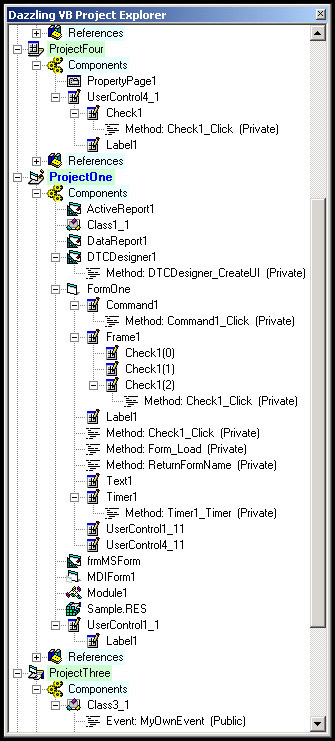



## Dazzling Project Explorer Version 1\.1

### Description

This VB IDE AddIn is the second and probably last version of the Dazzling Project Explorer. This sin simple terms is a project explorer that allows you to navigate through your project very easily and quickly using the tree view. The tree as you can see from the screenshot shows all the items in your project from components to controls and procedures and variables, and navigating to the item is just a CLICK away. I have incorporated one sugestion from my previous posting (v1.0). I have also corrected all bugs (he says with trepidation knowing what a bold statement that is... and that someone will prove him wrong).

I opted to leave version 1.0 on the site for a while at least (i.e. it may dissappear later) because I just thought that it might be useful for people to see version 1 and 1.1 side by side. The code in 1.0 was pretty well stuctured and therefore made the migration to 1.1 relatively simple because all that was basically required was changes to the applications flow rather than a rewrite. A very valuable lesson on the importance and one of the values of creating small procedures which do ONE thing.

I might in future write another AddIn using C# for the .NET IDE as I am busy teaching myself C# and I think this is a very useful little AddIn. So keep your eyes open, although it probably wont be in the near future.

I hope you all enjoy this and find it as useful as I do. I enjoy your feedback so please come back and post a comment. Vote if you want (I would appreciate it) but to me the most important is commentary/opinions/input/feedback. One last thing if anyone modifies or updates this please post a comment here so I can take a look at the improvements (or solution to any comment I have made in the code).
 
### More Info
 

             |
---                |---
**Submitted On**   |2002-10-27 12:08:38
**By**             |[Darryl Hasieber](https://github.com/Planet-Source-Code/PSCIndex/blob/master/ByAuthor/darryl-hasieber.md)
**Level**          |Intermediate
**User Rating**    |4.9 (74 globes from 15 users)
**Compatibility**  |VB 6\.0
**Category**       |[Miscellaneous](https://github.com/Planet-Source-Code/PSCIndex/blob/master/ByCategory/miscellaneous__1-1.md)
**World**          |[Visual Basic](https://github.com/Planet-Source-Code/PSCIndex/blob/master/ByWorld/visual-basic.md)
**Archive File**   |[Dazzling\_P14889010292002\.zip](https://github.com/Planet-Source-Code/darryl-hasieber-dazzling-project-explorer-version-1-1__1-40252/archive/master.zip)

